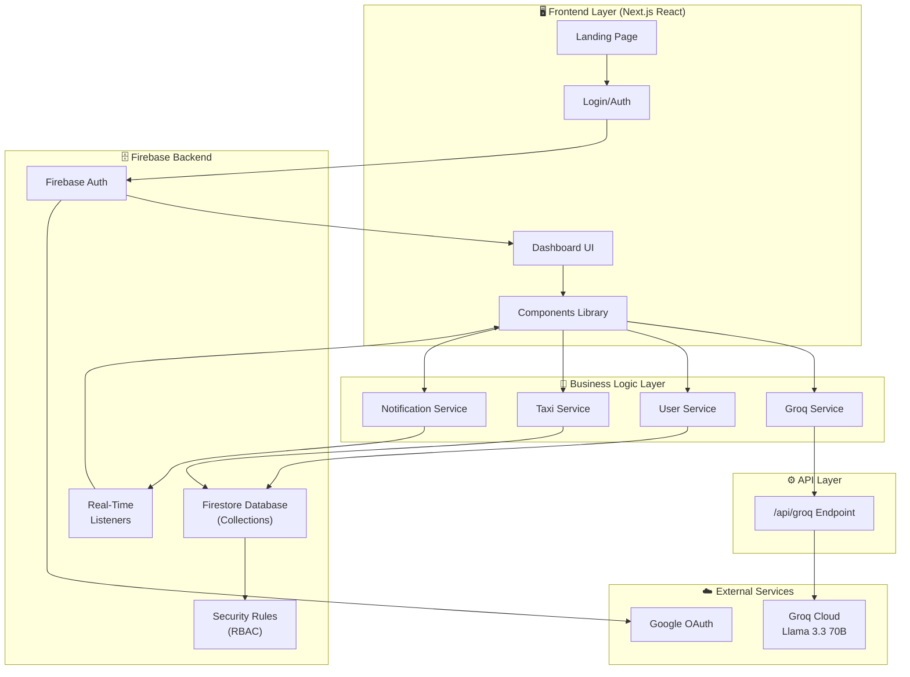
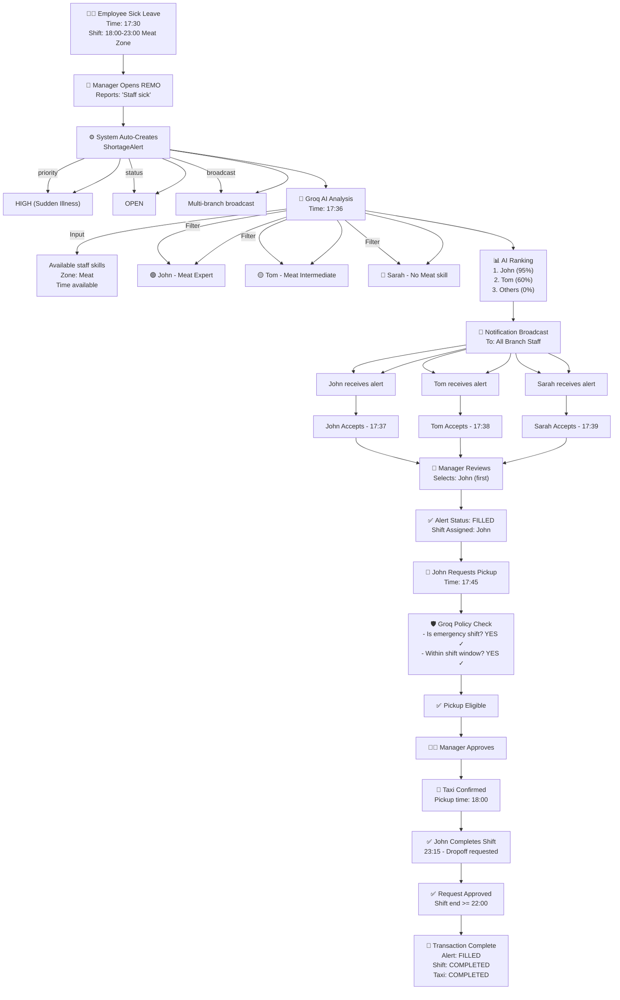
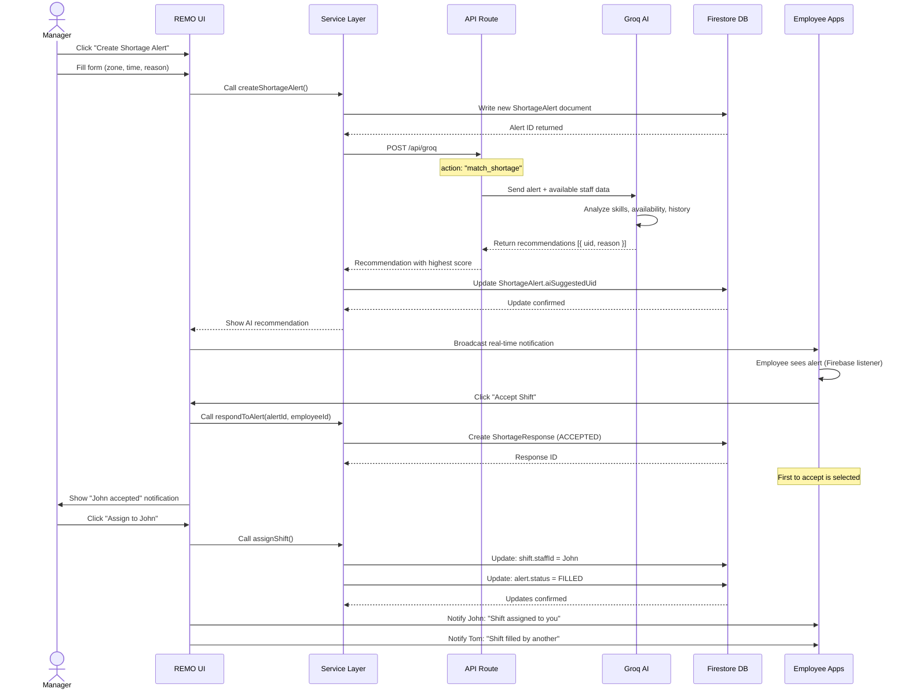
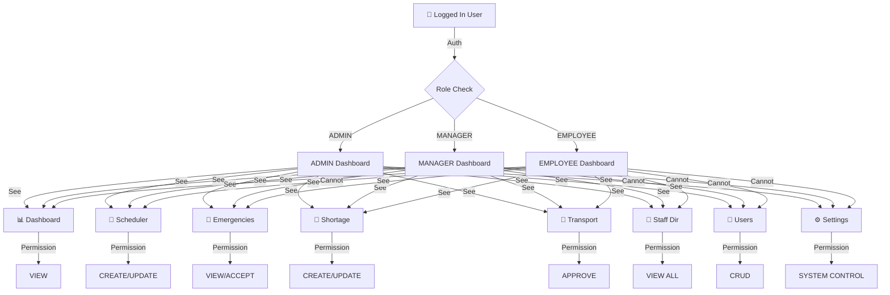
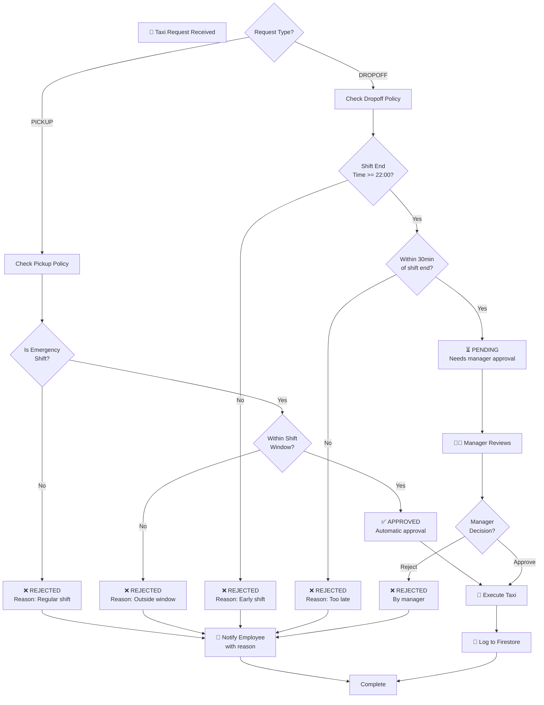
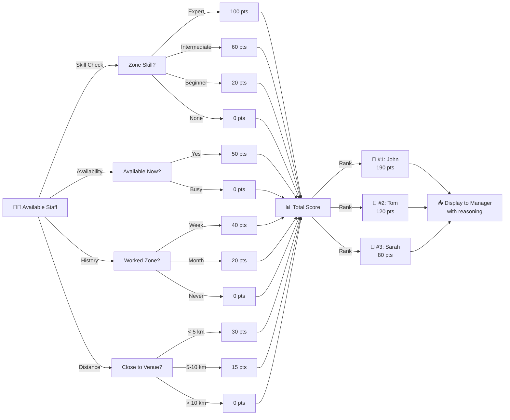
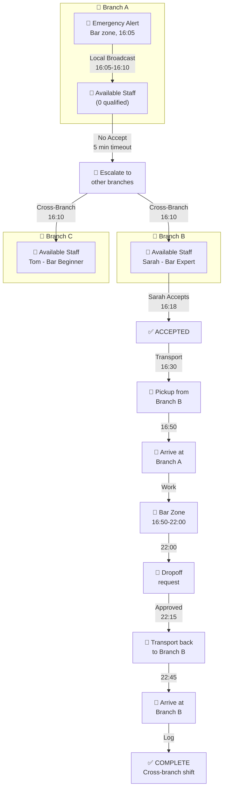
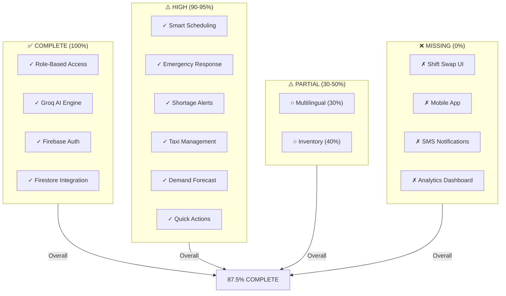

# REMO System Diagrams & Visual Documentation
## For Thesis Presentation & Research

---

## 1. High-Level System Architecture

---

## 2. Emergency Shift Workflow (Detailed)

---

## 3. Data Flow: Shortage Alert Creation to Assignment

---

## 4. Role-Based Access Control Matrix

---

## 5. Taxi Policy Decision Tree

---

## 6. AI Recommendation Scoring System

---

## 7. Multi-Branch Emergency Coordination

---

## 8. Firestore Collections Schema

```mermaid
graph TD
    FB["🗄️ Firestore Database"]
    
    FB -->|Collection| Users["users/"]
    Users -->|Doc| User1["{uid}"]
    User1 -->|Fields| UF1["email, name, role"]
    User1 -->|Fields| UF2["branchId, skills[]"]
    User1 -->|Fields| UF3["availability, language"]
    
    FB -->|Collection| Branches["branches/"]
    Branches -->|Doc| Branch1["{branchId}"]
    Branch1 -->|Fields| BF1["name, address"]
    Branch1 -->|Fields| BF2["managerId, createdAt"]
    
    FB -->|Collection| Alerts["shortageAlerts/"]
    Alerts -->|Doc| Alert1["{alertId}"]
    Alert1 -->|Fields| AF1["createdBy, zone"]
    Alert1 -->|Fields| AF2["date, startTime, endTime"]
    Alert1 -->|Fields| AF3["priority, status"]
    Alert1 -->|Fields| AF4["aiSuggestedUid, aiReason"]
    Alert1 -->|SubCollection| Responses["responses/"]
    Responses -->|Doc| Response1["{responseId}"]
    Response1 -->|Fields| RF1["employeeUid, status"]
    Response1 -->|Fields| RF2["respondedAt"]
    
    FB -->|Collection| Taxis["taxiRequests/"]
    Taxis -->|Doc| Taxi1["{taxiId}"]
    Taxi1 -->|Fields| TF1["staffId, shiftId"]
    Taxi1 -->|Fields| TF2["type (PICKUP/DROPOFF)"]
    Taxi1 -->|Fields| TF3["status, approvedBy"]
    
    FB -->|Collection| Shifts["shifts/"]
    Shifts -->|Doc| Shift1["{shiftId}"]
    Shift1 -->|Fields| SF1["staffId (null=vacant)"]
    Shift1 -->|Fields| SF2["branchId, zone"]
    Shift1 -->|Fields| SF3["date, startTime, endTime"]
    Shift1 -->|Fields| SF4["status, isEmergency"]
    
    FB -->|Collection| Inventory["inventory/"]
    Inventory -->|Doc| Item1["{itemId}"]
    Item1 -->|Fields| IF1["name, category"]
    Item1 -->|Fields| IF2["currentStock, minimumStock"]
    Item1 -->|Fields| IF3["status, unit"]
```

---

## 9. Feature Implementation Status

---

## 10. User Journey: First-Time Manager

```mermaid
graph LR
    A["🌐 Lands on<br/>Landing Page"]
    B["📝 Clicks 'Sign In'"]
    C["✍️ Creates Account<br/>(Auto ADMIN)"]
    D["🏢 Add First Branch"]
    E["👥 Add Staff Members"]
    F["📅 Create Schedule"]
    G["⚙️ Optimize with AI"]
    H["✅ Publish Schedule"]
    I["📊 Monitor Dashboard"]
    J["🚨 Handle Emergencies<br/>(Real-time alerts)"]
    K["✅ Taxi Approvals"]
    
    A --> B
    B --> C
    C --> D
    D --> E
    E --> F
    F --> G
    G --> H
    H --> I
    I --> J
    J --> K
    K -->|Ready| Loop["🔄 Daily Operations"]
```

---

**END OF DIAGRAMS**
